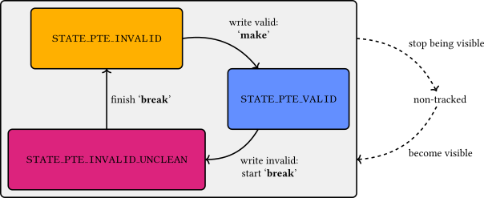

# Overview

Casemate is constructed of 3 parts:

1. A sound abstraction of the underlying architecture, which requires software to follow a set of given protocols.

2. A runtime library which embeds a monitor,
which tracks the softwares use of the protocol and reports deviations.

2. Tracing infrastructure and an offline checker,
which can perform the same check from a log file.

The break-before-make protocol
---

Arm requires updates to the pagetable to follow a particular discipline, **break-before-make**:
to update a pagetable entry,
it must first be _broken_ (made invalid, and required TLB maintenance performed) before the new value is written (the entry is _made_).

We implement an abstract model with an abstract memory,
where each location contains a little automata which tracks the progress of break-before-make,
and detects if the program misses a step.

### Automaton

The page table entry automaton is written as a hierarchical automaton
which keeps track of how far into break-before-make its page table entry is.
At its toplevel, it keeps track whether a page table entry is:

1. `STATE_PTE_VALID`, meaning it contains a valid descriptor.

2. `STATE_PTE_INVALID`, meaning it contains an invalid descriptor and is propagated to all cores.

3. `STATE_PTE_INVALID_UNCLEAN`, meaning it contains an invalid descriptor, but some cores might still see
the old, overwritten valid descriptor.

The point of the automaton is that, for example,
if a page table entry is in the `STATE_PTE_VALID` state of the automaton,
writing a valid descriptor to it (with a different output address)
is a violation of break-before-make.
The instrumentation keeps track of these writes (among other instructions),
and flags such a violation as a <span style="color: white; background-color: red;">`BBM valid->valid`</span>.

On the other hand, following break-before-make by
writing an *invalid* descriptor starts the "break",
and transitions to the `STATE_PTE_INVALID_UNCLEAN` state of the automaton.

The rest of the automaton follows the same overall structure:



The `STATE_PTE_INVALID_UNCLEAN` state of the automaton
(like the `STATE_PTE_VALID` and `STATE_PTE_INVALID` states) is itself a subautomaton.
Its substructure has two purposes:
it keeps track of how much the invalid descriptor has been pushed to other cores,
and it remembers the old valid descriptor.
In the simplest case, the automaton tracks that the
write of the invalid descriptor is pushed to the MMUs of all cores
by the sequence of a `DSB`, followed by a `TLBI VAE2IS`, and finally another `DSB`
which takes the entry to the `STATE_PTE_INVALID` state.


The old valid descriptor is kept because, if it is a table descriptor,
the old page table that it points to remains visible by the MMUs until the "break" is finished.
This is a key way in which the automaton account for the observable relaxed behaviour
of page tables.

Unlike the write of the descriptor, the `DSB`s do not explicitly carry
the information of which addresses they are meant to affect,
so the automata of all the page table entries are affected.

In addition, invalidating a "table" page table entry makes the sub-page table it used to point to
not visible to the MMUs anymore (once the invalidation has been pushed through).
In the automaton, this is modelled as the "implicit" transitions of the figure:
a write to a page table entry changes not only its automaton,
but also, if it is a "table" descriptor, the automata of the page table entries reachable from it.

Instrumentation
---

Source code can be linked with the runtime library,
to perform tracing or checking,
and the code instrumented with calls to casemate which step the abstract model in the monitor.

For example,
for each instruction which affects a page table entry
(for example a `WRITE_ONCE(...)`),
a function call that performs the corresponding transition on the automata
(for example `casemate_model_step_write( ...)`).

For example, a classic pattern is to perform writes to a pagetable during a software pagetable walk,
and those can be annotated directly:
```C
if (!((ctx->old ^ new) & ~KVM_PTE_LEAF_ATTR_HI_SW)) {
  WRITE_ONCE(*ctx->ptep, new);
#ifdef COMPILE_WITH_CASEMATE
  casemate_model_step_write(WMO_plain, virt_to_phys(ctx->ptep), new);
#endif
  return 0;
}
```

Similarly, all `DSB`s, `TLBI`s, as well as operations to relevant special registers via `MSR`/`MRS`, etc,
can easily be annotated.

### Atomicity and ownership

For each pagetable location, the model tracks a single automata:
capturing the current state of the pagetable entry which corresponds to that location.

In order for this approach to be valid, accesses to pagetable locations must be synchronised,
so that therefore at each update to a pagetable location we can assert a 'current state' exists at all;
additionaly, we require that this location appears in at most one tree of translation tables, in at most one branch, for the same reasons as previously given.
This, in effect, requires trees rather than DAGs more generally for the translation tables,
and prevents sharing of translation table entries between different pagetables.

Furthermore, writes to pagetable entries in a tree may require inspecting or updating the automata of entries below it in the tree,
so in those cases we must ensure synchronisation between the different levels in the same tree.

The model enforces both of these concerns by explicitly encoding a locking discipline:
each entry is associated with a tree (a root),
each root is associated with a lock,
accesses to pagetables must be done while holding the lock for that tree's root,
entries may only be disassociated with a root once properly invalidated and cleaned.

Soundness and completeness
---

Our model is designed to refine the base architectural model, but operationally.
To do this soundly, the model makes some assumptions about the behaviour of the code:

1. It assumes that the code is disciplined and does not rely
on corners of the architecture that exist to support legacy hypervisor designs
(so the model is complete 'enough' to capture real software).

2. It assumes that the code is synchronised enough; in particular we assume that accesses to the abstract state can be serialized (e.g. with locks, see limitations).
